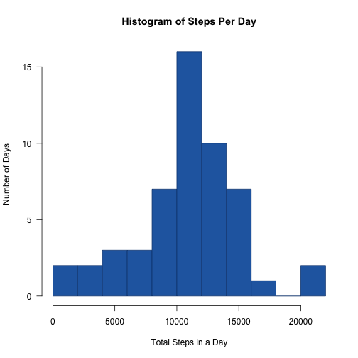
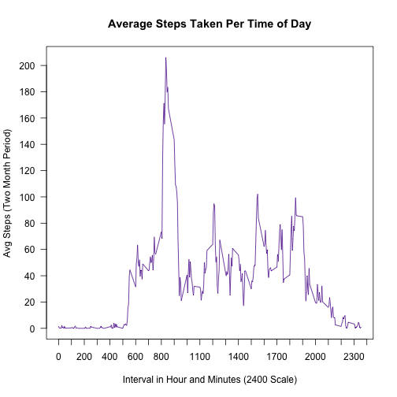
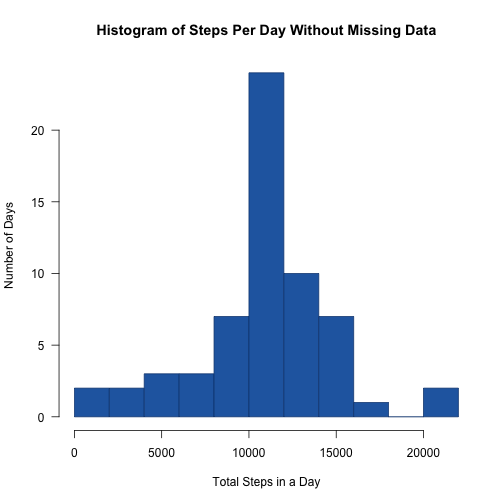
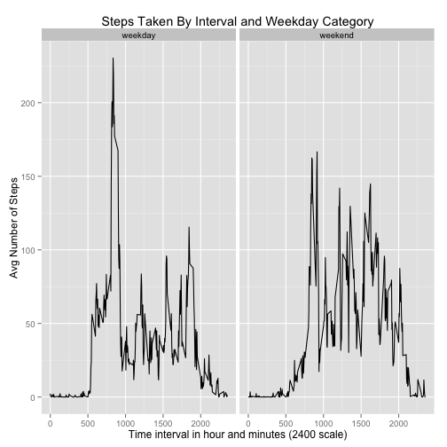

## Loading and preprocessing the data  

The data used for this analysis is taken from a device that records the number of steps taken by  
the wearer of the device. The recordings take place every 5 minutes and this data is from  
a two-month period of time, October-November, 2012  
The .zip file is contained in this repository. Unzip the file and save the file to your  
working directory before proceeding with the following code.


```r
# Before running this script, make sure your "working directory" is the current
# location of the downloaded data file 'activity.csv'

WD <- getwd()
rawdata <- read.csv(paste(WD, "/activity.csv", sep = ""))
```

## What is the mean total number of steps taken per day?

For this part of the assignment, we ignore the missing values in the dataset.  
There are 3 parts to this question:  
1. Calculate the total number of steps taken per day, and create a separate (smaller)  
  data set in the process  
2. Make a histogram of the total number of steps taken each day. This will show  
  the frequency of quantities of steps taken, and what quantities tend to occur with  
  much greater frequency than others; it will also give us a general idea of the  
  distribution of outcomes  
3. Calculate and report the mean and median of the total number of steps taken per day  
  If the mean, median and mode (peak of the frequency histogram) are the same, and  
  the histogram is approximately bell-shaped, then we can observe that the data appear  
  to be normally distributed.


```r
# The plyr and dplyr packages are needed to run this script
require(plyr)
require(dplyr)

# Question 1: What is the mean total number of steps taken per day?
# Related question: Is this a good measure of central tendency for this sample?
# In other words, do the mean, median and mode agree? If so, does the distribution of total steps taken
# appear to be normal?
# Subset the data set into a new data table to work with just the dates and number of steps taken
steps_taken <- rawdata[,-(3), drop=FALSE]

# Calculate the total number of steps each day and create a table of dates and total steps taken
total_per_day <- ddply(steps_taken, .(date), numcolwise(sum))

# Create a histogram of steps per day counting number of days within each range
# Each column on the graph covers a range of 2,000 steps taken in a day
# First column, for example, displays the number of days between 0 and 2000 steps taken
# NA dates are ignored

# All plots will be printed to a .png file except in RMarkdown
# The following sets the print device and filename

# png(filename="histogram1.png", width=480, height=480, units='px')

hist(total_per_day$steps, breaks=9,
     col = "#2569AF",
     border = "#08417D",
     las = 1,
     main = "Histogram of Steps Per Day",
     xlab = "Total Steps in a Day",
     ylab = "Number of Days",
     )
```

 

```r
# Calculate the mean and median steps per day and print

print(paste("The mean steps per day is ", 
            round(mean(total_per_day$steps, na.rm=TRUE), digits=0), sep=""))
```

```
## [1] "The mean steps per day is 10766"
```

```r
print(paste("The median steps per day is ", 
            round(median(total_per_day$steps, na.rm=TRUE), digits=0), sep=""))
```

```
## [1] "The median steps per day is 10765"
```

```r
# dev.off()

# End of Question 1
```

After completing this part of the process, you should have received a mean of 10,766  
and median of 10,765. Also, from the histogram we see that the data are, in fact,  
approximately normally distributed.

## What is the average daily activity pattern?
1. Make a time series plot, or line graph with time intervals on the x-axis. For each  
  interval (x) we will compute the average over 2 months of the steps taken during  
  that time interval. This average will be the (y-value) of the plot. Note: this will  
  result in 288 observations being plotted since there are 288 5-minute time intervals in  
  a 24-hour day.  
2. Which 5-minute time interval from part 1 contains the maximum average number of steps?


```r
# Question 2: What is the average daily activity pattern?
# To answer this question, we'll need to look at steps taken over different time intervals

# extract the two columns for steps and time interval and create a new data set
# with just these two columns; then average steps by time interval

steps_by_time_interval <- rawdata[,-(2), drop=FALSE]
avg_per_time_interval <- ddply(steps_by_time_interval, 
                               .(interval), 
                               numcolwise(mean, na.rm=TRUE))
# Plot a time series plot of the results

# png(filename="timeseries1.png", width=480, height=480, units='px')

plot(steps ~ interval, type = "l", data = avg_per_time_interval,
     las = 1,
     col = "#550A96",
     lab = c(24, 10, 7),
     xlab = "Interval in Hour and Minutes (2400 Scale)",
     ylab = "Avg Steps (Two Month Period)",
     main = "Average Steps Taken Per Time of Day")
```

 

```r
# Find the maximum avg number of steps taken by time interval
# Find the observation pertaining to the maximum and print

maximum <- max(avg_per_time_interval$steps, na.rm=TRUE)
time_interval_max <- avg_per_time_interval[grepl(as.character(maximum), 
                                                 as.character(avg_per_time_interval$steps)),]

print(paste("The time interval pertaining to the maximum number of steps is ", 
            time_interval_max$interval, "."))
```

```
## [1] "The time interval pertaining to the maximum number of steps is  835 ."
```

```r
print(paste("The maximum number of steps is ", round(maximum, digits=0), "."))
```

```
## [1] "The maximum number of steps is  206 ."
```

```r
# dev.off()

# End Question 2, Parts 1 and 2
```

In answering the third question, you should determine that the maximum occurs when  
interval = 0835, or at 8:35 am. The maximum (average) steps taken in 5 minutes is 206.
This suggests that there is an increase in the level of activity at this time of day  
when averaged over the entire 2 months' time.

## Inputing missing values
In this data set, there is missing data (coded as NA). Sometimes missing data  
can introduce bias into some calculations or summaries of the data.  
1. Calculate and report the total number of missing values in the dataset  
  In other words, how many observations (rows) contain NA?  
2. Devise a strategy for filling in missing values. In our case, it was decided to  
  use the calculated averages for each time interval and, for every time interval with  
  a missing value, insert the average for that time interval.  
3. Create a new dataset that is equal to the original dataset but with the missing data  
  filled in.  
4. Make a histogram of the total number of steps taken each day and calculate and report  
  the **mean** and **median** total number of steps taken per day. Do these values differ  
  from the estimates from the first part of the assignment? What is the impact of inputing  
  missing data on the estimates of the total daily number of steps?
  

```r
# We will now explore the effect of replacing missing values with reasonable estimates
# Count number of missing values and report
nmissing <- function(x) {
      sum(is.na(x))
}

missing_values <- nmissing(rawdata$steps)
print(paste("The number of missing observations is ", missing_values))
```

```
## [1] "The number of missing observations is  2304"
```

```r
# Subset rawdata on rows with NA under steps
rawdata_NA <- rawdata[(is.na(rawdata$steps)),]
# Remove the "steps" column from the NA data frame
rawdata_NA <- rawdata_NA[,-1]
# Create a new "steps" column so that the time intervals match with avg steps data
newdata_NA <- join(rawdata_NA, avg_per_time_interval, by = "interval")

# Subset rawdata on rows without NA under steps
rawdata_without_NA <- rawdata[(!is.na(rawdata$steps)),]

# Put the non-NA rows back together with the new NA rows (no longer NA)
# tidy data set is back to 17,568 observations but the NA's have been replaced
# with the avg steps taken in that time interval throughout the 2 months

tidy_data <- rbind(newdata_NA, rawdata_without_NA)

# In the orignal code we write our tidy dataset to an external file
# This will not happen here because we only want the raw data file saved
# write.table(tidy_data, file = "activity_tidy.csv", sep = ",", row.names = FALSE, col.names = TRUE)

# We will now revisit Question 1 with the NA values filled in
# Start by removing the unwanted column from the tidy data (time intervals)
# Put it into a data frame
steps_taken_new <- tidy_data[,-(2), drop=FALSE]

# Calculate the NEW total number of steps each day and create a table of dates and total steps taken
total_per_day_new <- ddply(steps_taken_new, .(date), numcolwise(sum))

# Create a histogram of steps per day counting number of days within each range
# Each column on the graph covers a range of 2,000 steps taken in a day
# First column, for example, displays the number of days between 0 and 2000 steps taken
# Missing values have been supplied in an attempt to provide realistic numbers

# png(filename="histogram2.png", width=480, height=480, units='px')

hist(as.integer(total_per_day_new$steps), breaks=12,
     col = "#2569AF",
     border = "#08417D",
     las = 1,
     main = "Histogram of Steps Per Day Without Missing Data",
     xlab = "Total Steps in a Day",
     ylab = "Number of Days",
)
```

 

```r
# dev.off()
# Calculate the mean and median steps per day and print

print(paste("The mean steps per day is ", 
            round(mean(total_per_day_new$steps, na.rm=TRUE), digits=0), sep=""))
```

```
## [1] "The mean steps per day is 10766"
```

```r
print(paste("The median steps per day is ", 
            round(median(total_per_day_new$steps, na.rm=TRUE), digits=0), sep=""))
```

```
## [1] "The median steps per day is 10766"
```

```r
# End revisit Question 1. It would appear that filling in missing data
# did not have a huge impact on estimating the number of steps taken in a typical day
# Filling in missing data did have an impact on variance, however. The number of days within
# 1,000 steps of the mean is much greater.
```

Results were as follows: there were 2,304 missing observations (rows). The new data set  
obtained from filling in average steps per time interval resulted in the following:  
- The mean number of steps taken per day was again 10,766  
- The median number of steps taken per day was also 10,766   

The histogram created from the completed data set shows a similar pattern except  
there is a more dramatic central tendency. There is a significantly higher peak  
at the center, making the variance appear less. The implication is that  
a majority of days are within roughly 1,000 steps of the mean.  

## Are there differences in activity patterns between weekdays and weekends?  

1. Create a new factor variable in the dataset with two levels - "weekday" and "weekend"  
  indicating whether a given date is a weekday or weekend day.  

2. Make a panel plot containing a time series plot of the 5-minute intervals (x) and  
  the average number of steps taken, averaged across all weekday days or weekend days.  
  This should result in 576 separate observations which will be split between two graphs.  
  

```r
# Question 4: Are there differences in activity patterns between weekdays and weekends?
# Add a column to the tidy data set called "day.type" of data type factor that
# contains one of two values: "weekday" and "weekend"
# This allows us to distinguish between data that was taken from a weekday versus not

tidy_data$day.type <- ifelse(as.POSIXlt(tidy_data$date)$wday %in% 1:5, "weekday", "weekend")
tidy_data$day.type <- as.factor(tidy_data$day.type)

# Now calculate the average steps taken by time interval and by weekday or not weekday
# Create a new data set with only these 576 observations

avg_tidy_data <- ddply(tidy_data, c("interval","day.type"), summarise, meansteps = mean(steps))

# Set the plot device
# png(filename="panel_plot.png", width=480, height=480, units='px')

require(ggplot2)
panel_plot <- ggplot(data=avg_tidy_data, aes(x=interval, y=meansteps)) + 
      geom_line() +
      facet_grid(. ~ day.type) + guides(fill=F) +
      ylab('Avg Number of Steps') + 
      xlab('Time interval in hour and minutes (2400 scale)') + 
      ggtitle('Steps Taken By Interval and Weekday Category')
print(panel_plot)
```

 

```r
# dev.off()
```

There is a distinct difference in the pattern, or spread of activity between a weekend  
day and a weekday day. 
